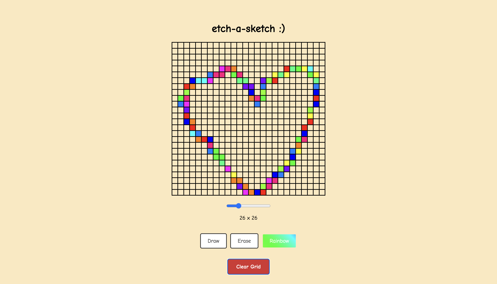

# Etch-a-Sketch Project

A [website](https://justinshawacademy.github.io/etch-a-sketch/) using HTML, CSS, and Javascipt

## Features

- **Dynamic Grid Generation**: Adjustable grid size from 2x2 to 100x100
- **Multiple Drawing Modes**: Draw (black), Erase (clear), and Rainbow (random colors)
- **Clear Function**: Reset the entire grid with one click
- **Animated UI**: Rainbow gradient animation for the rainbow mode button
- **Responsive Design**: Clean, centered layout with custom fonts

---

## Programming Fundamentals Learned

### Core JavaScript Concepts

*   **DOM Manipulation:** The foundation of interactive web development - connecting JavaScript to HTML elements.
    *   **Element Selection:** Using `document.getElementById()` to get references to specific HTML elements by their unique ID.
    *   **Dynamic Content Creation:** Using `document.createElement()` to generate HTML elements programmatically (creating thousands of grid squares).
    *   **Modifying Element Properties:** Changing `style.backgroundColor` to color squares and `style.gridTemplateColumns/Rows` to reshape the grid.
    *   **Event Handling:** Making the page interactive by responding to user actions.
        *   **`addEventListener()`:** Attaching 'mouseover', 'click', and 'input' event listeners to create drawing and UI interactions.
        *   **Event Types:** Understanding different event types like `mouseover` for drawing, `click` for buttons, and `input` for sliders.

*   **Fundamental Programming Logic:**
    *   **Variables & State Management:** Using `let` and `const` to store application state like `currentMode` (tracks draw/erase/rainbow) and `GRID_SIZE` constant.
    *   **Functions:** Breaking code into reusable, single-purpose functions (`createGrid()`, `getRandomRainbowColor()`, `clearGrid()`).
    *   **String-Based State:** Moving from boolean logic to string-based modes ('draw', 'erase', 'rainbow') for scalable feature expansion.
    *   **Conditional Logic:** Using `if...else if...else` chains to handle different drawing modes and user interactions.
    *   **Random Number Generation:** Combining `Math.random()` and `Math.floor()` to select random array elements.
    *   **Arrays & Data Structures:** Storing collections of data (12 rainbow colors) and accessing them via index.

*   **Advanced JavaScript Concepts:**
    *   **Template Literals:** Using backticks and `${}` syntax for dynamic string interpolation (`repeat(${grid_size}, 1fr)`).
    *   **`forEach()` Method:** Iterating through collections of DOM elements to apply operations to each one.
    *   **`querySelectorAll()`:** Selecting multiple elements at once to perform batch operations.
    *   **Function References:** Passing functions as arguments (`addEventListener('click', clearGrid)`) without invoking them.

### Advanced CSS Concepts

*   **CSS Grid for Complex Layouts:** Modern layout system for creating dynamic, responsive grids.
    *   **`display: grid`:** Establishing a grid container for precise element positioning.
    *   **`grid-template-columns/rows`:** Using `repeat()` function and `1fr` units to create equal-sized, flexible grid tracks.
    *   **Dynamic Grid Sizing:** Programmatically changing grid structure with JavaScript.

*   **Flexbox for UI Components:** Advanced layout system for organizing interface elements.
    *   **`display: flex`:** Creating flexible containers for button groups and controls.
    *   **`flex-direction: column`:** Stacking elements vertically.
    *   **`justify-content` and `align-items`:** Centering content both horizontally and vertically.
    *   **`gap`:** Modern property for spacing between flex items.

*   **Advanced Visual Effects:**
    *   **CSS Gradients:** Creating `linear-gradient()` with multiple color stops for rainbow effects.
    *   **CSS Animations:** Using `@keyframes` to create smooth, repeating animations.
    *   **Background Manipulation:** Controlling `background-size` and `background-position` for animated gradient effects.
    *   **CSS Specificity:** Understanding how `#rainbow-btn.active` overrides `.mode-btn.active` through ID and class specificity.

*   **The Box Model & Modern CSS:**
    *   **`box-sizing: border-box;`:** Essential for predictable layouts where padding and borders are included in element dimensions.
    *   **CSS Transitions:** Using `transition: all 0.3s ease` for smooth hover and state change effects.
    *   **Transform Effects:** Using `transform: translateY()` to create visual depth and interaction feedback.
    *   **Box Shadows:** Adding depth with `box-shadow` for professional button hover states.

*   **Typography & External Resources:**
    *   **Custom Fonts:** Importing Google Fonts using `@import` and applying with `font-family`.
    *   **Font Weights:** Using different font weights (`400`, `700`) for visual hierarchy.

